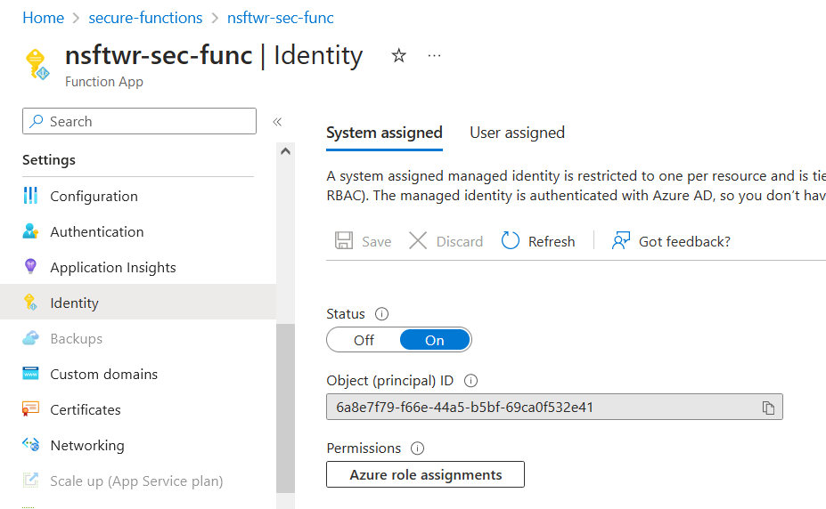
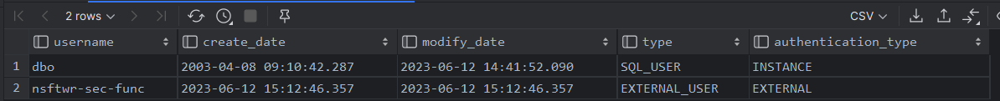
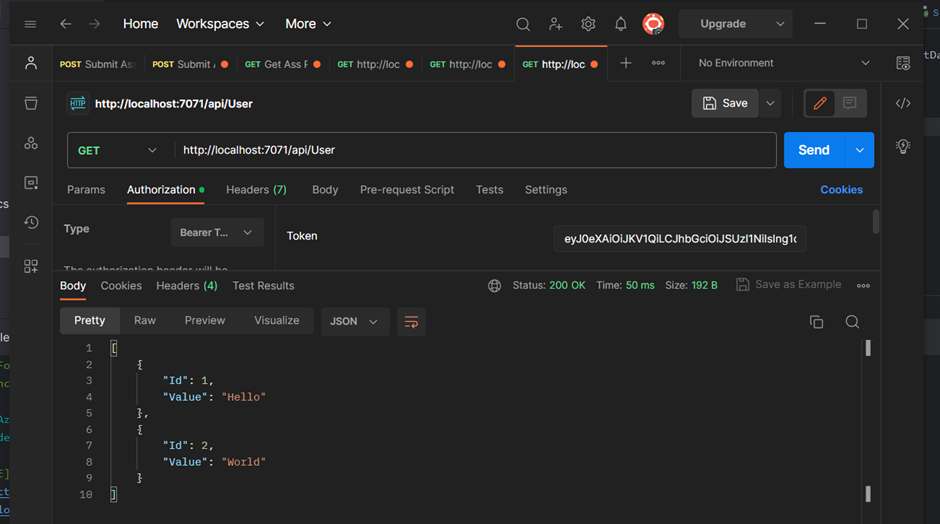

DISCLAIMER: This is not my code. All credit goes [juunas11](https://github.com/juunas11) & repo [IsolatedFunctionsAuthentication](https://github.com/juunas11/IsolatedFunctionsAuthentication).

[TOC]

# Instructions:

1. Log into Azure and go to Active Directory


2. Navigate to App Registrations and create a new app registration


3. Once created, enter the app registration and navigate to 'Expose an API'. Within there, add a new scope called 'user_impersonation'


4. Navigate to 'App Roles' and create the necessary app roles for users


5. Once all roles have been added, navigate back to Active Directory and go to 'Enterprise Applications'. There will be an application with the same name you entered for the app registration. Under 'Users and groups' add the required users and their roles accordingly to the access they will need


6. Clone the repo

7. Add the `local.settings.json` filling in your Tenant Id and Application Client Id details.

```json
{
  "IsEncrypted": false,
  "Values": {
    "AzureWebJobsStorage": "UseDevelopmentStorage=true",
    "FUNCTIONS_WORKER_RUNTIME": "dotnet-isolated",
    "AuthenticationAuthority": "https://login.microsoftonline.com/your-aad-tenant-id",
    "AuthenticationClientId": "api://your-aad-client-id"
  }
}
```

8. Once all of the things above have been completed, you can launch the function application locally.


9. Open Powershell and enter these commands to acquire a JWT token to access your function app. This script will get the token and automatically copy it in your clipboard.

```ps
az login --scope api://your-aad-client-id/user_impersonation --tenant your-aad-tenant-id
(az account get-access-token --scope api://your-aad-client-id/user_impersonation --query accessToken).TrimStart('"').TrimEnd('"') | Set-Clipboard -Value {$_.Trim()}
```

10. Using [jwt.io](https://jwt.io/) we can decipher the token and see if all the required details have been acquired.


11. Using Postman you can test the authorization locally. If you have all the required roles, the API will return a 200, if not, then 403. 


If you're using an expired token you will receive a 401.


Now your Azure Functions are secured with Azure Active Directory Application roles.

<hr>

Additinally, you can use Azure Functions to be the middleman between an enduser and data by securing who can access what.

For this example an Azure SQL database will be provisioned with the following table

```sql
CREATE TABLE secfunc
(
  "Id" int IDENTITY(1,1) PRIMARY KEY,
  "Value" varchar(1028)
)
```

First and foremost, to allow the function to be used to access the SQL server, the function app needs to have an System assigned identity. That can be done under the 'Identity' tab for the Azure Function resource provisioned.



Once that has been turned on, log onto the SQL server and add the function app identity to the database users

```sql
CREATE USER [nsftwr-sec-func] FROM EXTERNAL PROVIDER;
ALTER ROLE db_datareader ADD MEMBER [nsftwr-sec-func];
ALTER ROLE db_datawriter ADD MEMBER [nsftwr-sec-func];
```

You can check if it was successful by entering this command

```sql
SELECT name AS username,
       create_date,
       modify_date,
       type_desc AS type,
       authentication_type_desc AS authentication_type
FROM sys.database_principals
WHERE type NOT IN ('A', 'G', 'R', 'X')
  AND sid IS NOT NULL
  AND name != 'guest'
ORDER BY username;
```



Finally, the UserFunction returns the database entries in a JSON object.



# How it works in a nutshell